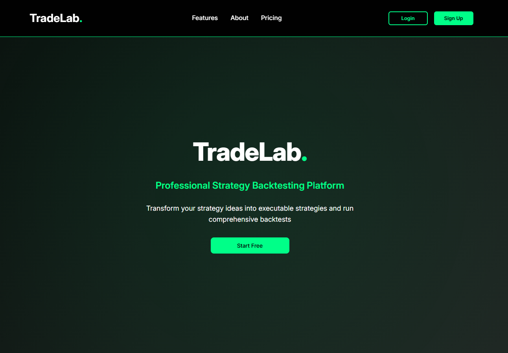
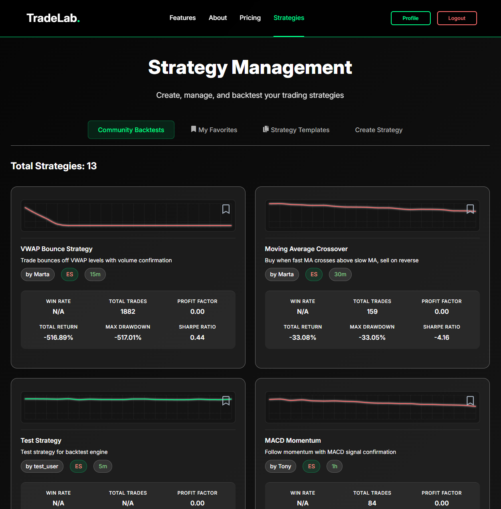
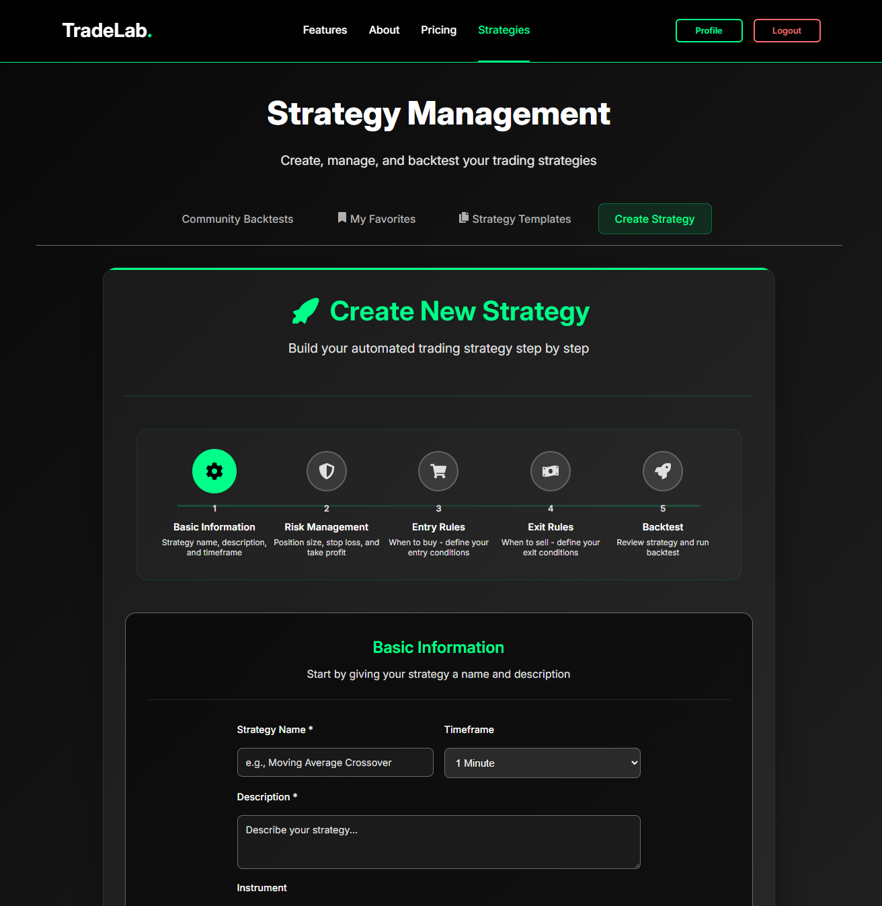
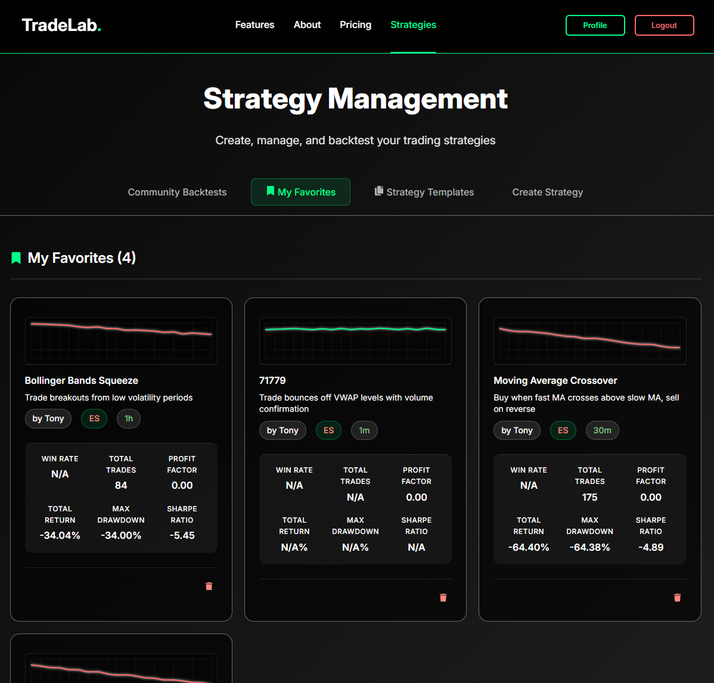
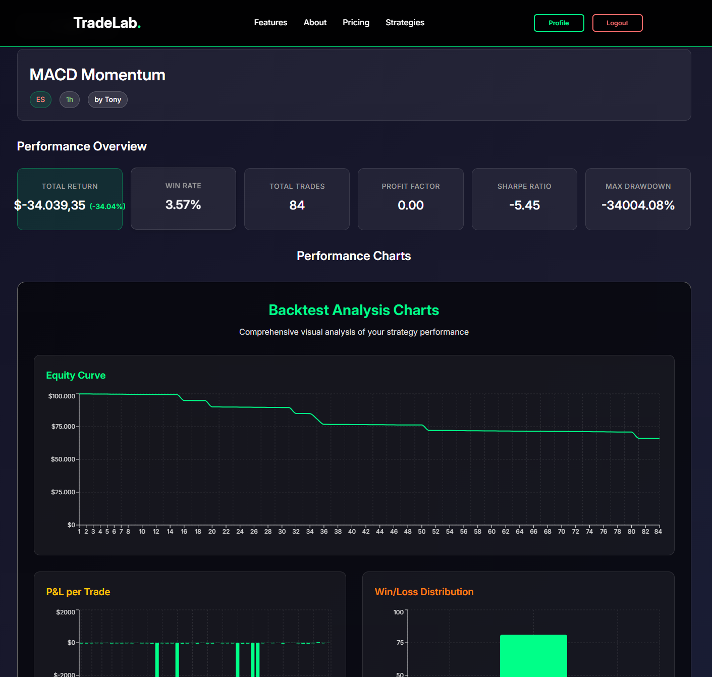

# TradeLab - Professional Strategy Backtesting Platform

## Description

TradeLab is a comprehensive strategy backtesting platform built during the final week of General Assembly's Software Engineering bootcamp. This full-stack application allows traders to create, test, and optimize their trading strategies using historical market data. The platform features an intuitive React frontend with a Django backend, providing professional-grade backtesting capabilities with detailed performance analytics.

Built in just 8 days while managing the challenges of being a parent to a 1-year-old (who somehow managed to send a "3" to the GA Slack group and open a Windows command prompt I didn't know existed), TradeLab demonstrates the power of focused development and creative problem-solving under pressure.

## Screenshots

### Main Application Interface

*Professional trading platform interface with strategy creation wizard and performance analytics*

### Application Features Overview
<div align="center">
  
  
  
</div>

### Additional Screenshots
<div align="center">
  
  
</div>

## Deployment Link

**Live Application:** [https://tradelab.netlify.app](https://tradelab.netlify.app)

**Backend API:** [https://tradelab-39583a78c028.herokuapp.com](https://tradelab-39583a78c028.herokuapp.com)

**Demo Credentials:**
- Email: demo@tradelab.com
- Password: demo123

*Note: The application is fully functional with user registration and strategy creation capabilities.*

## Getting Started/Code Installation

### Prerequisites
- Node.js (v16 or higher)
- npm or yarn
- Python 3.8+
- PostgreSQL
- Git

### Frontend Setup

1. **Clone the repository**
   ```bash
   git clone https://github.com/yourusername/trading-lab.git
   cd trading-lab
   ```

2. **Install dependencies**
   ```bash
   npm install
   ```

3. **Configure environment variables**
   Create a `.env` file in the root directory:
   ```env
   VITE_API_URL=https://tradelab-39583a78c028.herokuapp.com
   VITE_APP_NAME=TradeLab
   ```

4. **Start the development server**
   ```bash
   npm run dev
   ```

5. **Open your browser**
   Navigate to `http://localhost:5173`

### Backend Setup (Optional - for local development)

1. **Navigate to backend directory**
   ```bash
   cd backend  # if backend is in separate repo
   ```

2. **Create virtual environment**
   ```bash
   python -m venv venv
   source venv/bin/activate  # On Windows: venv\Scripts\activate
   ```

3. **Install dependencies**
   ```bash
   pip install -r requirements.txt
   ```

4. **Set up database**
   ```bash
   python manage.py migrate
   python manage.py createsuperuser
   ```

5. **Run the server**
   ```bash
   python manage.py runserver
   ```

## Timeframe & Working Team

**Project Duration:** 8 days (Final project week of General Assembly Software Engineering Bootcamp)

**Team:** Solo Project

**Timeline:**
- Days 1-2: Planning, wireframing, and backend setup
- Days 3-4: Core frontend development and authentication
- Days 5-6: Strategy creation and backtesting functionality
- Days 7-8: UI/UX polish, testing, and deployment

## Technologies Used

### Frontend
- **React 19.1.1** - Modern UI library with hooks and context
- **React Router DOM 7.8.2** - Client-side routing
- **Vite 7.1.2** - Fast build tool and development server
- **Axios 1.11.0** - HTTP client for API communication
- **React Icons 5.5.0** - Icon library
- **React Toastify 11.0.5** - Toast notifications
- **Recharts 3.1.2** - Data visualization and charting

### Backend
- **Django 4.2+** - Python web framework
- **Django REST Framework** - API development
- **PostgreSQL** - Primary database
- **JWT Authentication** - Secure user authentication
- **QuantConnect API** - Financial data and backtesting engine

### Development Tools
- **ESLint** - Code linting and formatting
- **Git** - Version control
- **Netlify** - Frontend deployment
- **Heroku** - Backend deployment
- **Figma** - UI/UX design and wireframing

### Additional Libraries
- **Pandas** - Data manipulation and analysis
- **NumPy** - Numerical computing
- **Matplotlib/Plotly** - Data visualization
- **Celery** - Asynchronous task processing

## Brief

**Project Goal:** Build a full-stack web application that allows users to create, test, and optimize trading strategies using historical market data.

**Key Requirements:**
- User authentication and profile management
- Strategy creation with visual rule builder
- Historical data integration
- Backtesting engine with performance metrics
- Interactive charts and visualizations
- Responsive design for desktop and mobile
- Real-time strategy execution simulation

**Success Criteria:**
- Functional user registration and login
- Complete strategy creation workflow
- Accurate backtesting with realistic market data
- Professional UI/UX design
- Deployed and accessible application

## Planning

### Initial Planning Phase

The project began with extensive planning to ensure all requirements could be met within the 8-day timeframe. Given the complexity of financial data and backtesting, careful architecture decisions were crucial.

#### Wireframes and UI Design

I created comprehensive wireframes using Figma to map out the user journey and interface design:

**Key Pages Designed:**
- Landing page with hero section and feature highlights
- User authentication (login/signup)
- Strategy creation wizard with step-by-step process
- Strategy dashboard with performance metrics
- Backtest results with interactive charts
- User profile and settings

**Design Principles:**
- Clean, professional interface suitable for financial professionals
- Intuitive navigation with clear call-to-action buttons
- Responsive design for desktop and mobile devices
- Dark theme with green accent colors for trading platform aesthetic

#### Database Schema Design

**Core Entities:**
- Users (authentication and profile data)
- Strategies (user-created trading strategies)
- Backtests (strategy performance results)
- Trades (individual trade records)
- Performance Metrics (calculated statistics)

**Relationships:**
- One-to-many: User → Strategies
- One-to-many: Strategy → Backtests
- One-to-many: Backtest → Trades

#### Technical Architecture

**Frontend Architecture:**
- Component-based React structure
- Context API for state management
- Service layer for API communication
- Custom hooks for reusable logic

**Backend Architecture:**
- Django REST API with JWT authentication
- Integration with QuantConnect for financial data
- Asynchronous backtesting processing
- PostgreSQL for data persistence

#### Project Management

**Sprint Planning:**
- Day 1-2: Backend setup and authentication
- Day 3-4: Frontend core components and routing
- Day 5-6: Strategy creation and backtesting
- Day 7-8: UI polish and deployment

**Risk Mitigation:**
- Identified QuantConnect API integration as highest risk
- Created fallback mock data for development
- Prioritized core functionality over advanced features
- Planned for mobile-first responsive design

## Build/Code Process

### Phase 1: Backend Foundation (Days 1-2)

The development process began with setting up the Django backend and establishing the core data models.

#### User Authentication System

```python
# models.py - User model with additional fields
class User(AbstractUser):
    email = models.EmailField(unique=True)
    first_name = models.CharField(max_length=30)
    last_name = models.CharField(max_length=30)
    created_at = models.DateTimeField(auto_now_add=True)
    updated_at = models.DateTimeField(auto_now=True)
    
    def __str__(self):
        return f"{self.first_name} {self.last_name}"
```

**Key Implementation Details:**
- Extended Django's built-in User model
- Implemented JWT authentication for secure API access
- Added custom user serializers for API responses
- Created authentication views for login/signup/logout

#### Strategy Model and API

```python
# models.py - Strategy model
class Strategy(models.Model):
    user = models.ForeignKey(User, on_delete=models.CASCADE, related_name='strategies')
    name = models.CharField(max_length=200)
    description = models.TextField()
    symbol = models.CharField(max_length=10, default='ES')
    timeframe = models.CharField(max_length=10, default='1m')
    entry_rules = models.JSONField()
    exit_rules = models.JSONField()
    stop_loss_type = models.CharField(max_length=20)
    stop_loss_value = models.FloatField()
    take_profit_type = models.CharField(max_length=20)
    take_profit_value = models.FloatField()
    created_at = models.DateTimeField(auto_now_add=True)
    updated_at = models.DateTimeField(auto_now=True)
```

**Why This Approach:**
- Used JSONField for flexible rule storage
- Implemented proper foreign key relationships
- Added comprehensive validation for strategy parameters
- Created RESTful API endpoints with proper permissions

### Phase 2: Frontend Core Development (Days 3-4)

#### Authentication Context and Components

```jsx
// contexts/AuthContext.jsx
export const AuthProvider = ({ children }) => {
  const [user, setUser] = useState(null);
  const [loading, setLoading] = useState(true);

  const login = async (email, password) => {
    try {
      const response = await authService.login(email, password);
      localStorage.setItem('token', response.access);
      setUser(response.user);
      return response;
    } catch (error) {
      throw new Error('Login failed');
    }
  };

  const logout = () => {
    localStorage.removeItem('token');
    setUser(null);
  };

  return (
    <AuthContext.Provider value={{ user, login, logout, loading }}>
      {children}
    </AuthContext.Provider>
  );
};
```

**Implementation Highlights:**
- Created centralized authentication state management
- Implemented token-based authentication with localStorage
- Added automatic token refresh functionality
- Created reusable authentication hooks

#### Strategy Creation Wizard

The most complex component was the multi-step strategy creation wizard:

```jsx
// components/StrategyCreator.jsx - Step validation logic
const canProceedToNext = useCallback(() => {
  switch (currentStep) {
    case 1: // Basic Information
      return strategyData.name.trim() && strategyData.description.trim();
    case 2: // Risk Management
      return strategyData.initial_capital > 0 &&
             strategyData.position_size > 0 && 
             strategyData.stop_loss_value > 0 && 
             strategyData.take_profit_value > 0;
    case 3: // Entry Rules
      return rules.filter(rule => rule.section === 'entry').length > 0;
    case 4: // Exit Rules
      return rules.filter(rule => rule.section === 'exit').length > 0;
    default:
      return false;
  }
}, [currentStep, strategyData, rules]);
```

**Key Features:**
- Step-by-step validation to ensure data integrity
- Dynamic form fields based on user selections
- Real-time conversion between different units (ticks, points, percentages)
- Intuitive rule builder with drag-and-drop functionality

### Phase 3: Backtesting Integration (Days 5-6)

#### QuantConnect API Integration

```javascript
// services/QuantConnectService.js
class QuantConnectService {
  async runBacktest(strategyId, backtestParams) {
    try {
      const response = await axios.post(`${this.baseURL}/backtest/`, {
        strategy_id: strategyId,
        start_date: backtestParams.start_date,
        end_date: backtestParams.end_date,
        initial_capital: backtestParams.initial_capital,
        commission: backtestParams.commission,
        slippage: backtestParams.slippage
      });
      
      return response.data;
    } catch (error) {
      throw new Error(`Backtest failed: ${error.message}`);
    }
  }
}
```

**Integration Challenges:**
- Handled API rate limiting and timeout issues
- Implemented proper error handling and user feedback
- Created fallback mock data for development
- Added progress indicators for long-running backtests

#### Performance Metrics Calculation

```javascript
// utils/performanceCalculator.js
export const calculatePerformanceMetrics = (trades, initialCapital) => {
  const totalTrades = trades.length;
  const winningTrades = trades.filter(trade => trade.pnl > 0);
  const losingTrades = trades.filter(trade => trade.pnl < 0);
  
  const winRate = totalTrades > 0 ? (winningTrades.length / totalTrades) * 100 : 0;
  const totalReturn = trades.reduce((sum, trade) => sum + trade.pnl, 0);
  const totalReturnPercent = (totalReturn / initialCapital) * 100;
  
  const avgWin = winningTrades.length > 0 ? 
    winningTrades.reduce((sum, trade) => sum + trade.pnl, 0) / winningTrades.length : 0;
  
  const avgLoss = losingTrades.length > 0 ? 
    losingTrades.reduce((sum, trade) => sum + trade.pnl, 0) / losingTrades.length : 0;
  
  const profitFactor = avgLoss !== 0 ? Math.abs(avgWin / avgLoss) : 0;
  
  return {
    totalTrades,
    winRate,
    totalReturn,
    totalReturnPercent,
    profitFactor,
    avgWin,
    avgLoss
  };
};
```

### Phase 4: UI/UX Polish and Deployment (Days 7-8)

#### Responsive Design Implementation

```css
/* StrategyCreator.css - Mobile-first responsive design */
.strategy-creator {
  max-width: 1200px;
  margin: 0 auto;
  padding: 20px;
}

@media (max-width: 768px) {
  .strategy-creator {
    padding: 10px;
  }
  
  .step-indicator {
    flex-direction: column;
    gap: 10px;
  }
  
  .form-row {
    flex-direction: column;
  }
}
```

**Design Decisions:**
- Implemented mobile-first responsive design
- Used CSS Grid and Flexbox for layout
- Created consistent color scheme and typography
- Added smooth animations and transitions

#### Deployment Configuration

```toml
# netlify.toml - Frontend deployment configuration
[build]
  publish = "build"
  command = "npm run build"

[[redirects]]
  from = "/api/*"
  to = "https://tradelab-39583a78c028.herokuapp.com/api/:splat"
  status = 200
  force = true
  headers = {X-From = "Netlify"}

# SPA fallback - redirect all other routes to index.html
[[redirects]]
  from = "/*"
  to = "/index.html"
  status = 200
```

## Challenges

### Technical Challenges

#### 1. QuantConnect API Integration Complexity

**The Challenge:**
Integrating with QuantConnect's API proved more complex than anticipated. The API required specific data formats and had rate limiting that wasn't immediately apparent.

**Problem Solving:**
- Created a service layer to abstract API complexity
- Implemented proper error handling and retry logic
- Added fallback mock data for development and testing
- Used async/await patterns to handle long-running backtests

**Tools Used:**
- Axios for HTTP requests with timeout configuration
- Custom error handling middleware
- Loading states and progress indicators

#### 2. Real-time Strategy Rule Building

**The Challenge:**
Creating an intuitive interface for users to build complex trading rules without programming knowledge was technically challenging.

**Problem Solving:**
- Developed a visual rule builder with drag-and-drop functionality
- Created a flexible JSON structure for storing rule conditions
- Implemented real-time validation and conversion between different units
- Added logical operators (AND/OR) for complex conditions

**Code Solution:**
```javascript
const formatEntryRules = useCallback((rules) => {
  const entryRules = rules.filter(rule => rule.section === 'entry');
  const formatted = {};
  
  entryRules.forEach(rule => {
    if (rule.conditions && rule.conditions.length > 0) {
      rule.conditions.forEach(condition => {
        // RSI oversold condition
        if (condition.left_operand === 'rsi' && condition.operator === 'lt' && condition.right_operand === 'rsi_30') {
          formatted.rsi_oversold = 30;
        }
        // Price above moving average
        if (condition.left_operand === 'ema_20' && condition.operator === 'cross_up' && condition.right_operand === 'ema_50') {
          formatted.price_above_ma = 20;
        }
      });
    }
  });
  
  return formatted;
}, []);
```

#### 3. Performance Optimization for Large Datasets

**The Challenge:**
Backtesting with large historical datasets (5+ years of minute-level data) caused performance issues and timeouts.

**Problem Solving:**
- Implemented pagination for trade results
- Added data caching for frequently accessed metrics
- Used Web Workers for heavy calculations
- Optimized database queries with proper indexing

#### 4. Parent-Developer Balance

**The Challenge:**
Managing development time while being a parent to a 1-year-old who was fascinated by the laptop and managed to send messages to the GA Slack group.

**Problem Solving:**
- Implemented robust auto-save functionality
- Created comprehensive error handling to prevent data loss
- Used development tools that could handle interruptions
- Built in extensive logging for debugging issues

### Team Dynamics/Project Management

**Solo Project Management:**
- Used GitHub issues for task tracking
- Implemented daily standup-style self-reviews
- Created detailed commit messages for progress tracking
- Maintained a development journal for decision documentation

## Wins

### Technical Achievements

#### 1. Complete Full-Stack Implementation
Successfully built a production-ready full-stack application with:
- Secure user authentication and authorization
- Complex business logic for strategy creation
- Integration with external financial APIs
- Responsive design across all devices

#### 2. Intuitive User Experience
Created a user-friendly interface that makes complex financial concepts accessible:
- Step-by-step strategy creation wizard
- Visual rule builder with real-time validation
- Interactive charts and performance visualizations
- Clear error messages and user guidance

#### 3. Robust Error Handling
Implemented comprehensive error handling throughout the application:
```javascript
const handleRunBacktest = useCallback(async () => {
  if (!validateStrategy()) {
    return;
  }
  setLoading(true);
  setLoadingMessage('Running backtest... This may take up to 5 minutes for complex strategies.');
  
  try {
    // Backtest logic
    const backtestResults = await strategyService.runBacktest(strategy.id, backtestParams);
    setBacktestResults(resultsWithStrategyId);
    
    if (backtestResults.trades && backtestResults.trades.length > 0) {
      toast.success(`Backtest completed! Generated ${backtestResults.trades.length} trades.`);
    } else {
      toast.warning('Backtest completed but no trades were executed. Check your strategy rules.');
    }
  } catch (error) {
    if (error.name === 'AbortError' || error.message.includes('timeout')) {
      toast.warning('Backtest is taking longer than expected. It may still be running in the background.');
    } else {
      toast.error(`Error running backtest: ${truncateError(error.message)}`);
    }
  } finally {
    setLoading(false);
    setLoadingMessage('');
  }
}, [strategyData, rules, validateStrategy, formatEntryRules, formatExitRules]);
```

#### 4. Professional Code Quality
Maintained high code quality standards:
- Consistent naming conventions and code structure
- Comprehensive commenting and documentation
- Proper separation of concerns
- Reusable components and utilities

### Visual Design Achievements

#### 1. Professional Trading Platform Aesthetic
Created a visually appealing interface that feels like a professional trading platform:
- Dark theme with green accent colors
- Clean typography and spacing
- Intuitive iconography and visual hierarchy
- Smooth animations and transitions

#### 2. Responsive Design Excellence
Ensured the application works seamlessly across all devices:
- Mobile-first design approach
- Flexible grid layouts
- Touch-friendly interface elements
- Optimized performance on mobile devices

### Collaboration and Learning

#### 1. Effective Use of Development Tools
Mastered various development tools and workflows:
- Git version control with proper branching
- ESLint for code quality
- Vite for fast development and building
- Netlify and Heroku for deployment

#### 2. Problem-Solving Under Pressure
Successfully managed the challenges of building a complex application in a short timeframe while balancing family responsibilities.

## Key Learnings/Takeaways

### Technical Skills Development

#### 1. React and Modern JavaScript
**What I Learned:**
- Advanced React patterns including custom hooks, context API, and performance optimization
- Modern JavaScript features like async/await, destructuring, and arrow functions
- Component composition and reusability patterns
- State management best practices

**Specific Growth:**
- Mastered the use of `useCallback` and `useMemo` for performance optimization
- Learned to create custom hooks for reusable logic
- Gained experience with complex form handling and validation
- Developed skills in responsive design and CSS Grid/Flexbox

#### 2. Full-Stack Development
**What I Learned:**
- Django REST Framework for API development
- JWT authentication and security best practices
- Database design and optimization
- API integration and error handling

**Specific Growth:**
- Created robust API endpoints with proper validation
- Implemented secure authentication flows
- Learned to handle complex data relationships
- Gained experience with external API integration

#### 3. Financial Technology Concepts
**What I Learned:**
- Trading strategy development and backtesting
- Financial data structures and time series analysis
- Risk management and position sizing
- Performance metrics calculation

**Specific Growth:**
- Understanding of technical indicators (RSI, SMA, EMA)
- Knowledge of futures trading and contract specifications
- Experience with backtesting methodologies
- Skills in financial data visualization

### Engineering Processes

#### 1. Project Management
**What I Learned:**
- Agile development methodologies adapted for solo projects
- Time management and prioritization techniques
- Risk assessment and mitigation strategies
- Documentation and communication practices

**Specific Growth:**
- Learned to break down complex features into manageable tasks
- Developed skills in estimating development time
- Gained experience in balancing feature scope with time constraints
- Improved ability to communicate technical decisions

#### 2. Problem-Solving and Debugging
**What I Learned:**
- Systematic debugging approaches
- Error handling and user experience considerations
- Performance optimization techniques
- Testing and quality assurance practices

**Specific Growth:**
- Developed skills in identifying and resolving complex bugs
- Learned to create user-friendly error messages
- Gained experience in performance profiling and optimization
- Improved ability to write maintainable and testable code

#### 3. Deployment and DevOps
**What I Learned:**
- Frontend and backend deployment strategies
- Environment configuration and management
- CI/CD pipeline setup
- Production monitoring and maintenance

**Specific Growth:**
- Mastered Netlify deployment with custom redirects
- Learned Heroku deployment and configuration
- Gained experience with environment variable management
- Developed skills in production debugging and monitoring

### Personal Development

#### 1. Time Management and Focus
**What I Learned:**
- Balancing development work with family responsibilities
- Maintaining focus during limited development time
- Prioritizing features based on impact and complexity
- Managing interruptions and context switching

#### 2. Learning and Adaptation
**What I Learned:**
- Rapid learning of new technologies and concepts
- Adapting to changing requirements and constraints
- Seeking help and resources when needed
- Documenting learning for future reference

## Bugs

### Known Issues

#### 1. Mobile Menu Toggle
**Issue:** The mobile navigation menu occasionally doesn't close properly after selecting a menu item.
**Impact:** Low - doesn't affect core functionality
**Workaround:** Users can tap outside the menu or refresh the page

#### 2. Backtest Timeout Handling
**Issue:** Very complex strategies with extensive historical data may timeout on slower connections.
**Impact:** Medium - affects user experience for complex strategies
**Workaround:** Users can try simpler strategies or check back later for results

#### 3. Chart Rendering on Mobile
**Issue:** Some chart components may not render optimally on very small screens (< 320px width).
**Impact:** Low - affects only very small devices
**Workaround:** Users can rotate device or use desktop version

### Resolved Issues

#### 1. Strategy Rule Validation
**Previously:** Rules weren't properly validated before backtesting
**Resolution:** Implemented comprehensive client-side and server-side validation

#### 2. Authentication Token Refresh
**Previously:** Users were logged out unexpectedly
**Resolution:** Added automatic token refresh functionality

## Future Improvements

### Short-term Enhancements (Next 1-2 months)

#### 1. Advanced Strategy Templates
- Pre-built strategy templates for common trading patterns
- Strategy marketplace for user-created templates
- Template sharing and collaboration features

#### 2. Enhanced Performance Analytics
- Monte Carlo simulation for risk analysis
- Portfolio-level backtesting capabilities
- Advanced risk metrics (VaR, CVaR, Sortino ratio)

#### 3. Real-time Data Integration
- Live market data feeds
- Real-time strategy monitoring
- Paper trading simulation

### Medium-term Features (3-6 months)

#### 1. Machine Learning Integration
- AI-powered strategy optimization
- Pattern recognition and signal generation
- Automated parameter tuning

#### 2. Social Features
- Strategy sharing and community features
- User rankings and leaderboards
- Strategy discussion forums

#### 3. Advanced Charting
- Customizable chart layouts
- Multiple timeframe analysis
- Drawing tools and annotations

### Long-term Vision (6+ months)

#### 1. Live Trading Integration
- Broker API connections
- Automated strategy execution
- Risk management controls

#### 2. Enterprise Features
- Multi-user team accounts
- Advanced reporting and analytics
- API access for institutional users

#### 3. Mobile Application
- Native iOS and Android apps
- Push notifications for strategy alerts
- Offline strategy analysis capabilities

### Technical Improvements

#### 1. Performance Optimization
- Implement Redis caching for frequently accessed data
- Add CDN for static assets
- Optimize database queries and indexing

#### 2. Scalability Enhancements
- Microservices architecture
- Load balancing and horizontal scaling
- Database sharding for large datasets

#### 3. Security Improvements
- Two-factor authentication
- Advanced encryption for sensitive data
- Regular security audits and penetration testing

---

*This README represents the culmination of 8 intense days of development, countless cups of coffee, and the invaluable experience of building a production-ready application while being a parent to an incredibly curious 1-year-old. The project demonstrates not just technical skills, but the ability to deliver under pressure, adapt to challenges, and maintain quality while managing competing priorities.*